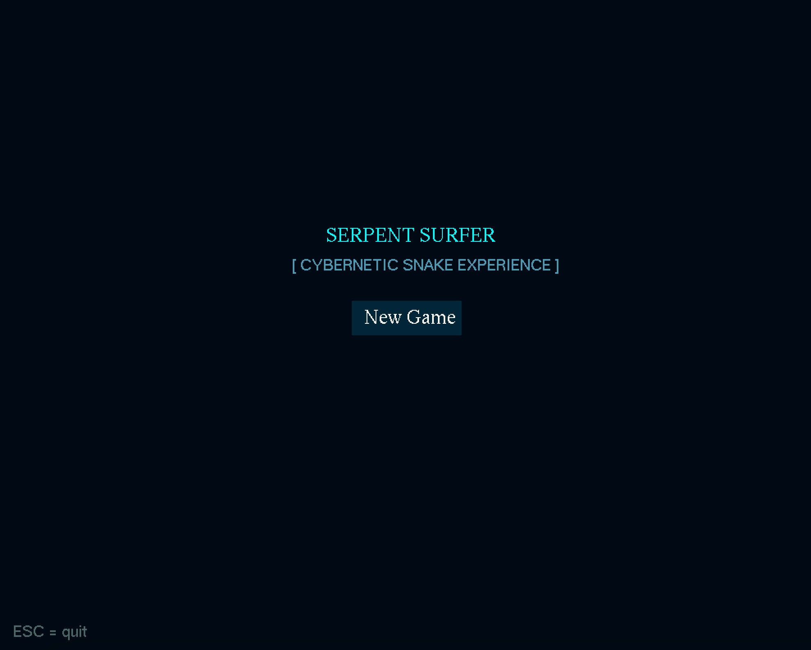
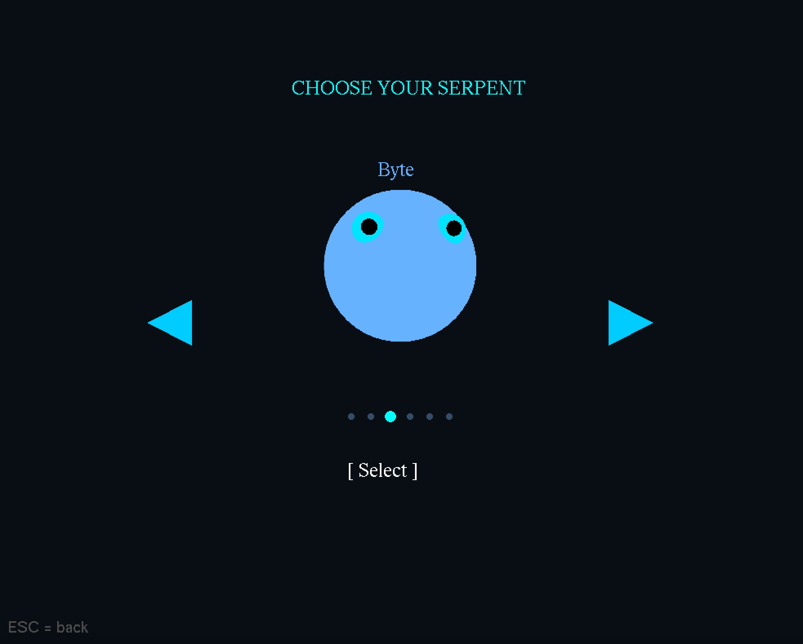
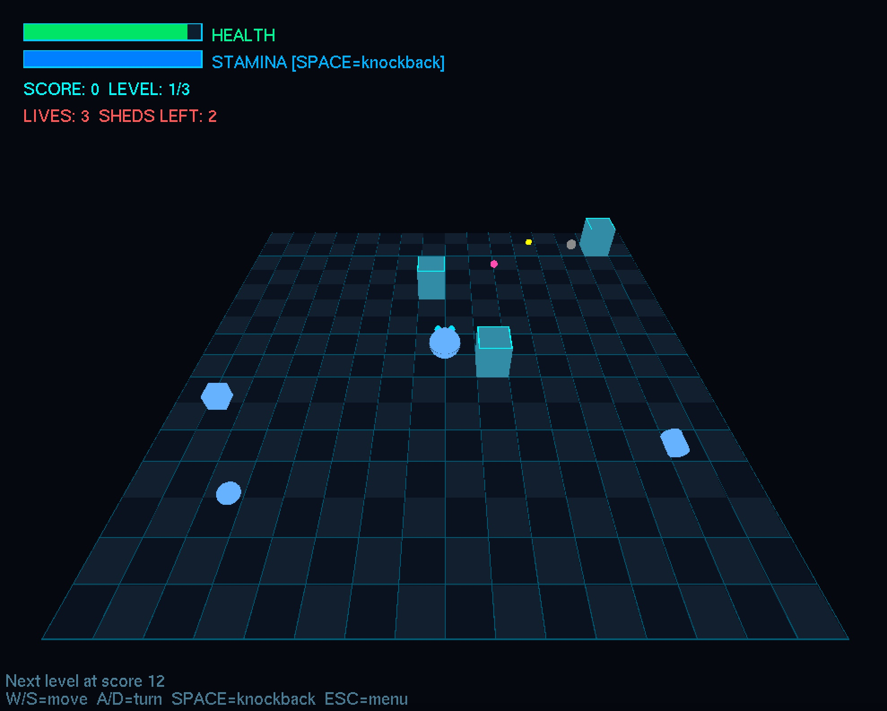
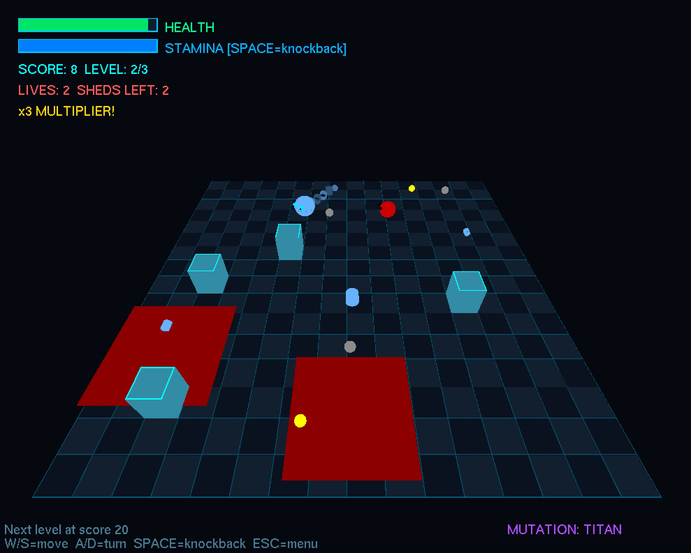

# 🐍 Serpent Surfer

> **CSE423: Computer Graphics** | BRAC University | Spring 2026  

---
## 👥 Team Members

| # | Name | Student ID | 
|---|------|------------|
| 1 | Tasmiah Ahmed | 23201517 |
| 2 | Anindita Mahjabin Sristy | 23201073 |
| 3 | Lamisa Raisa Amin | 23201362 |

---

## 📖 Overview

**Serpent Surfer** is a 3D OpenGL snake game developed for the CSE423 Computer Graphics course. Guide a growing serpent through a hazardous arena, collect glowing food, chain combo multipliers, survive enemy attacks, and progress through increasingly difficult levels.

### Files
- `project.py` → Final submitted version
- `gamev2.py` → Experimental version with additional gameplay modifications *(WIP)*

---

## 🎮 Features

- Combo scoring system
- Enemy AI
- Power-ups and mutations
- Environmental hazards
- Health and stamina mechanics

> Full instructions and gameplay details are shown in-game before starting.

---

## 🛠️ Built With

- Python
- OpenGL / PyOpenGL
- GLUT / FreeGLUT

## 🚀 Run the Game

```bash
git clone https://github.com/mieverse/SerpentSurfer.git
cd SerpentSurfer

pip install PyOpenGL PyOpenGL_accelerate

python project.py
```
## 🎮 Gameplay Preview

<p align="center">
  
  
</p>

<p align="center">
  
  
</p>